# Czarniecki - The Game

## Overview

Logo | Description
:---: | :---
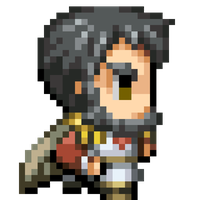 | Czarniecki - The Game is my high school project for contest about our patron Stefan Czarniecki - Polish nobleman. You can read about him at the [Wikipedia page](https://en.wikipedia.org/wiki/Stefan_Czarniecki).

## Screenshots

|||
--- | ---
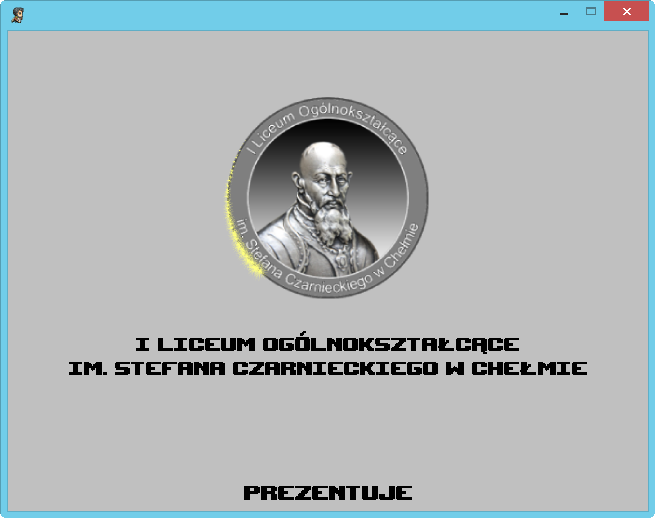 | 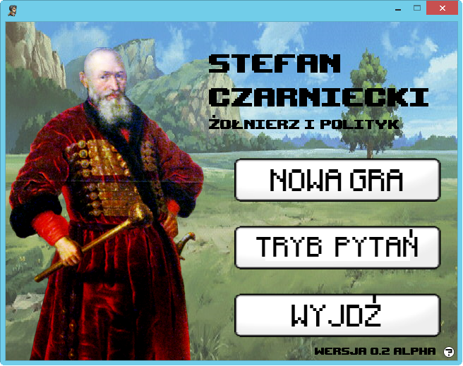
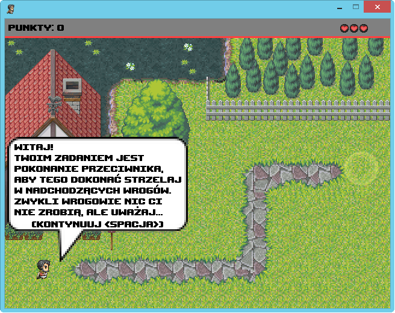 | 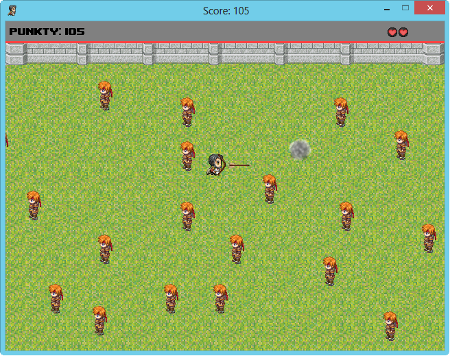
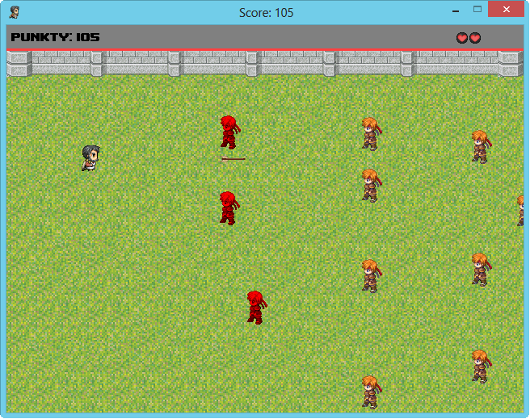 | 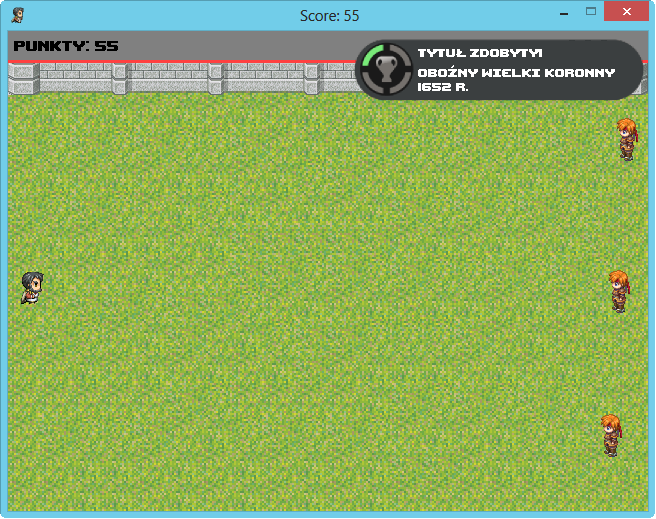
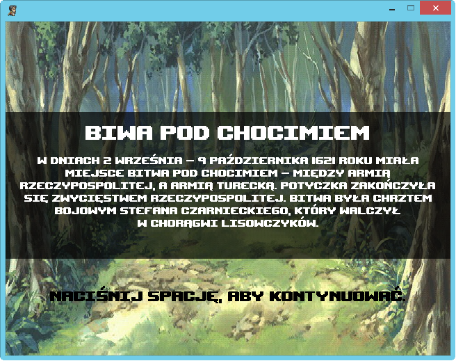 | 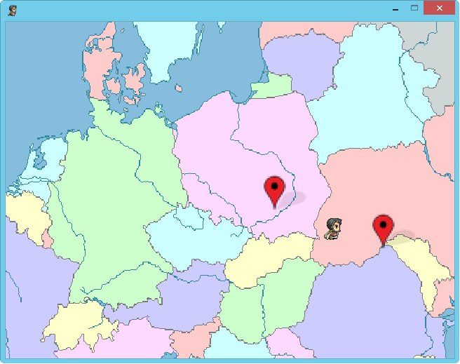
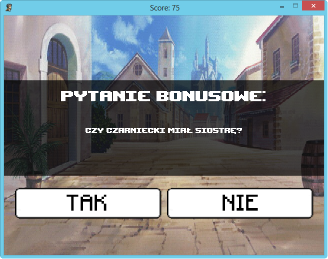 | 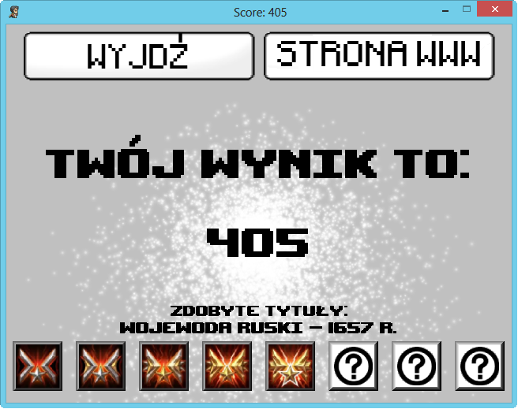 |

## Manual

[Manual](docs/description.txt) is available in Polish language.

## Download and changelog

Binaries are on release page.

In `/bin/cd` directory there is full CD version that went to contest.